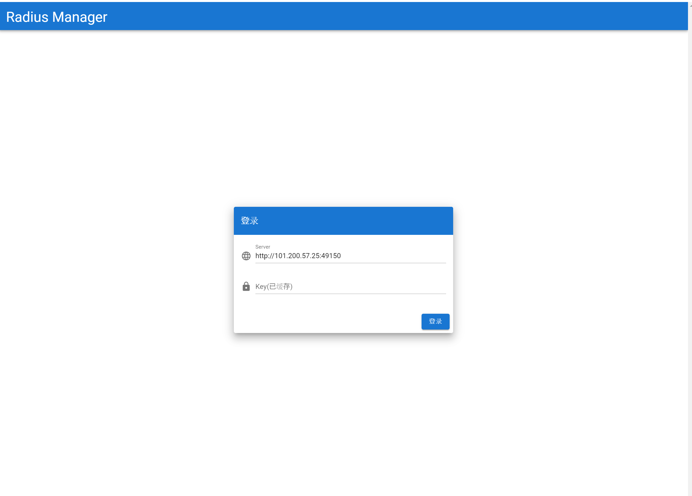
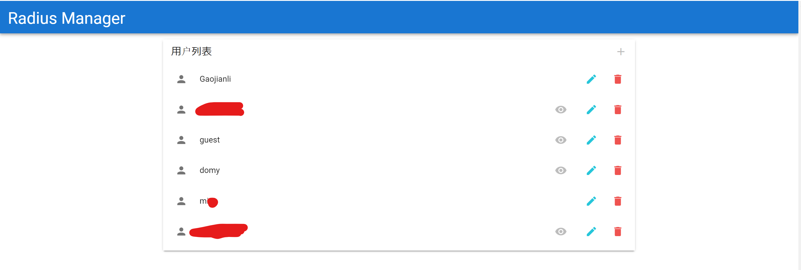
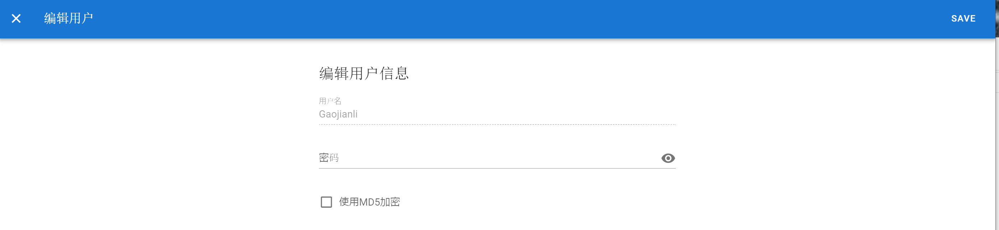

# Radius-manager-front

The frontend of the [Radius-Manager-backend](https://github.com/Gaojianli/Radius-Manager-backend), provide a easy way to manage users in the freeradius database.

## Project setup
```
npm install
```

### Compiles and hot-reloads for development
```
npm run serve
```

### Compiles and minifies for production
```
npm run build
```

### Compiles electron
```
npm run electron:build
```

### Screenshots





### Customize configuration
See [Configuration Reference](https://cli.vuejs.org/config/).
